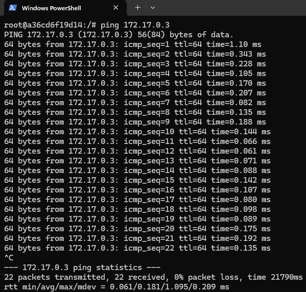

# Exercice 5 - Les réseaux Docker

Par défaut, Docker installe 3 réseaux :

- bridge
- none
- host

Exécutez la commande `docker network ls` pour les lister :

## 1. Le réseau "bridge"

- Créez le conteneur suivant :
    - **Nom** = web-1-bridge
    - **Image** = nginx
    - **Tag de l'image** = latest
    - **Port-binding** = port 8081 du Docker Host avec port 80 du conteneur

- Créez le second conteneur suivant :
    - **Nom** = db-bridge
    - **Image** = mysql
    - **Tag de l'image** = latest
    - **Valeur de la variable d'environnement MYSQL_ROOT_PASSWORD** = password

- Créez le troisième conteneur suivant :
    - **Nom** = web-2-bridge
    - **Image** = nginx
    - **Tag de l'image** = latest
    - **Port-binding** = port 8082 du Docker Host avec port 80 du conteneur

- Accédez aux applications de vos 2 conteneurs web via les URLs **http://localhost:8081** et **http://localhost:8082** et confirmez que vous tombez bien sur la page d'accueil de nginx :

- Exécutez la commande `docker inspect db-bridge` et identifiez l'adresse IP du conteneur db-bridge :

- Exécutez la commande `docker inspect web-2-bridge` et identifiez l'adresse IP du conteneur web-2-bridge :

- Exécutez la commande `docker exec -it web-1-bridge bash` pour lancer une session de terminal sur le conteneur web-1-bridge

- Installez l'utilitaire **ping** sur le conteneur en exécutant la commande `apt update && apt install -y iputils-ping`

- Exécutez la commande `ping {ip-du-conteneur-db-bridge}` depuis le conteneur web-1-bridge et notez le succès du ping (faites un CTRL+C pour l'arrêter) :

- Exécutez la commande `ping {ip-du-conteneur-web-2-bridge}` depuis le conteneur web-1-bridge et notez le succès du ping (faites un CTRL+C pour l'arrêter) :

- Exécutez la commande `ping db-bridge` depuis le conteneur web-1-bridge et notez cette fois l'échec du ping :

- Exécutez la commande `ping web-2-bridge` depuis le conteneur web-1-bridge et notez une nouvelle fois l'échec du ping :

Tapez **exit** pour sortir de la session de terminal sur le conteneur web-1-bridge.

## 2. Le réseau "none"

- Créez le conteneur suivant :
    - **Nom** = web-1-none
    - **Image** = nginx
    - **Tag de l'image** = latest
    - **Port-binding** = port 8083 du Docker Host avec port 80 du conteneur
    - **Réseau ([--network](https://docs.docker.com/reference/cli/docker/container/run/#network))** = none

- Créez le second conteneur suivant :
    - **Nom** = db-none
    - **Image** = mysql
    - **Tag de l'image** = latest
    - **Valeur de la variable d'environnement MYSQL_ROOT_PASSWORD** = password
    - **Réseau ([--network](https://docs.docker.com/reference/cli/docker/container/run/#network))** = none

- Créez le conteneur suivant :
    - **Nom** = web-2-none
    - **Image** = nginx
    - **Tag de l'image** = latest
    - **Port-binding** = port 8084 du Docker Host avec port 80 du conteneur
    - **Réseau ([--network](https://docs.docker.com/reference/cli/docker/container/run/#network))** = none

- Accédez aux applications de vos 2 conteneurs web via les URLs **http://localhost:8083** et **http://localhost:8084** et notez que cela ne fonctionne pas :

- Exécutez les commandes `docker inspect web-none` et `docker inspect db-none` et constatez que les conteneurs n'ont pas d'adresse IP :

## 3. Les réseaux custom

- A l'aide de la commande [**docker network create**](https://docs.docker.com/reference/cli/docker/network/create/) créez le réseau custom suivant :
    - **Nom** = mon-premier-reseau-custom
    - **Adresse de sous-réseau** = 182.18.0.0/16
    - **Driver** = bridge

- Exécutez la commande `docker network ls` et confirmez la présence de votre réseau custom :

- Créez le conteneur suivant :
    - **Nom** = web-1-custom
    - **Image** = nginx
    - **Tag de l'image** = latest
    - **Port-binding** = port 8085 du Docker Host avec port 80 du conteneur
    - **Réseau ([--network](https://docs.docker.com/reference/cli/docker/container/run/#network))** = mon-premier-reseau-custom

- Créez le second conteneur suivant :
    - **Nom** = db-custom
    - **Image** = mysql
    - **Tag de l'image** = latest
    - **Valeur de la variable d'environnement MYSQL_ROOT_PASSWORD** = password
    - **Réseau ([--network](https://docs.docker.com/reference/cli/docker/container/run/#network))** = mon-premier-reseau-custom

- Créez le conteneur suivant :
    - **Nom** = web-2-custom
    - **Image** = nginx
    - **Tag de l'image** = latest
    - **Port-binding** = port 8086 du Docker Host avec port 80 du conteneur
    - **Réseau ([--network](https://docs.docker.com/reference/cli/docker/container/run/#network))** = mon-premier-reseau-custom

- Accédez aux applications de vos 2 conteneurs web via les URLs **http://localhost:8085** et **http://localhost:8086** et confirmez que vous tombez bien sur la page d'accueil de nginx.

- Exécutez la commande `docker inspect db-custom` et identifiez l'adresse IP du conteneur db-custom :

- Exécutez la commande `docker inspect web-2-custom` et identifiez l'adresse IP du conteneur web-2-custom :

- Exécutez la commande `docker exec -it web-1-custom bash` pour lancer une session de terminal sur le conteneur web-1-custom

- Installez l'utilitaire **ping** sur le conteneur en exécutant la commande `apt update && apt install -y iputils-ping`

- Exécutez la commande **ping** pour "pinguer" les conteneurs **db-custom** et **web-2-custom** et notez que cela fonctionne :

- Exécutez les commandes `ping db-custom` et `ping web-2-custom` depuis le conteneur web-1-custom :

Notez que le **serveur DNS interne** de votre réseau custom a créé les alias DNS **db-custom.mon-premier-reseau-custom** et **web-2-custom.mon-premier-reseau-custom** pour les deux conteneurs que vous venez de pinguer.

Tapez **exit** pour sortir de la session de terminal sur le conteneur web-1-custom.